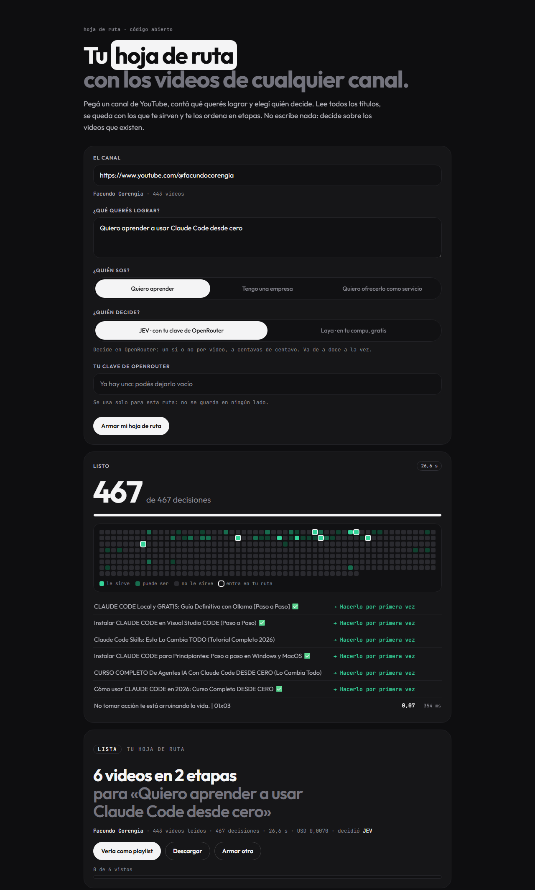
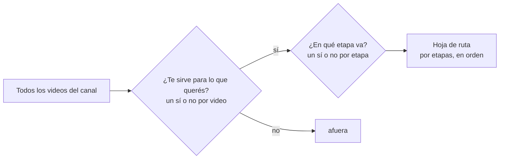

# Hoja de ruta

**Los videos de cualquier canal de YouTube, en el orden que te sirve.**

Le pasás la URL de un canal, le contás qué querés lograr y te arma la hoja de ruta: qué videos ver, en qué orden y por etapas. Corre en tu compu, anda con cualquier canal y cada ruta cuesta menos de un centavo.



> Lo muestro andando en este video: https://youtu.be/Ap8ZAvZXyjU

---

## Qué hace, en una línea

Lee todos los títulos del canal, se queda con los que te sirven para lo que querés lograr y los ordena en etapas. **No escribe nada**: decide sobre los videos que existen, así que no hay nada inventado.

## Arrancá en tres pasos

Necesitás **Python 3.10 o más nuevo** y una clave de **OpenRouter** (abajo te explico cómo se saca).

```bash
git clone https://github.com/fcori47/hoja-de-ruta.git
cd hoja-de-ruta
pip install -r requirements.txt
python app.py
```

Se abre `http://127.0.0.1:8765` en tu navegador. Ahí:

1. **Pegás el canal**: sirve `@canal`, `youtube.com/@canal`, `/channel/…`, `/c/…` o `/user/…`.
2. **Contás qué querés lograr**, en una frase: *«quiero armar mi agencia de IA y conseguir mis primeros clientes»*.
3. **Elegís quién sos**: quiero aprender, tengo una empresa o lo quiero ofrecer como servicio.
4. **Elegís quién decide**, JEV o Laya, y tocás **Armar mi hoja de ruta**.

Mientras decide, vas viendo pasar cada video con su probabilidad. Cuando termina:

- marcás los videos que ya viste, y quedan guardados en tu navegador;
- la abrís como **playlist de YouTube**, con un clic y sin tocar ninguna cuenta;
- la **descargás** como una página suelta, para tenerla o pasarla.

## ¿No querés tocar la terminal? Pedíselo a Claude Code o a Codex

Copiá esto y pegáselo a tu asistente de código:

```text
Cloná https://github.com/fcori47/hoja-de-ruta, instalalo siguiendo su CLAUDE.md en un entorno virtual
y levantá la app. Cuando necesites mi clave de OpenRouter, pedímela y guardala en el archivo .env
(nunca en el código). Al final, abrime http://127.0.0.1:8765.
```

El repo trae un `CLAUDE.md` con todo lo que un asistente necesita: cómo se instala, cómo se prueba, qué no tiene que tocar y cómo agregar un perfil nuevo. Codex lo encuentra por `AGENTS.md`.

---

## Cómo decide

Son dos pasadas, y en las dos el modelo **elige** en vez de escribir:



1. **¿Este video te sirve?** Un sí o no, con su probabilidad, a todos los videos del canal.
2. **¿En qué etapa del camino va?** Solo a los que sirven: un sí o no por cada etapa, todas en una sola pregunta.

Después arma la ruta:
- cada etapa se queda con los videos que le encajan;
- adentro de cada etapa van primero los que más te sirven, y entre parecidos, los más nuevos;
- si un video está subido dos veces (o con un título casi igual), queda uno solo.

### Las etapas dependen de quién sos

| Perfil | Etapas |
|---|---|
| **Quiero aprender** | Entender qué es → Hacerlo por primera vez → Mejorarlo → Ir más allá |
| **Tengo una empresa** | Qué le sirve a tu empresa → Casos reales → Cómo se implementa → Que siga andando |
| **Quiero ofrecerlo como servicio** | Entender qué es → Qué ofrecer → Conseguir clientes → Cierre y entrega de servicio |

### Un ejemplo real

Pedido: *«Quiero armar mi agencia de IA y conseguir mis primeros clientes»*, perfil **Quiero ofrecerlo como servicio**, sobre un canal de 443 videos. Esto es un pedazo de la ruta que salió:

| Etapa | Algunos de los videos que eligió |
|---|---|
| Entender qué es | Cómo Empezar Tu Agencia de IA Paso a Paso (Curso 2026) · Los 3 Problemas al Crear una Agencia/Consultoria de IA |
| Qué ofrecer | No Vendas "Agentes de IA", Vendé ESTO (Con Pruebas) · CRM de WhatsApp con Agente de IA (Instalación Completa) |
| Conseguir clientes | Cómo Conseguir Clientes para tu Agencia de IA (el Método Real) · Cómo Conseguir Tu PRIMER CLIENTE de IA (Clase Completa) |
| Cierre y entrega de servicio | CLAUDE CODE: Cómo Construir y VENDER Sistemas de IA (Guía 2026) |

---

## Quién decide: JEV o Laya

Los dos son modelos que **deciden en lugar de escribir**, con la misma forma de preguntar: les pasás la situación y las opciones, y te devuelven cuál, con su probabilidad.

| | **JEV** (recomendado) | **Laya** |
|---|---|---|
| Dónde corre | OpenRouter, con tu clave | En tu compu |
| Lo que cuesta | Menos de un centavo por ruta | Nada |
| Lo que tarda | 6 a 26 s, según el canal | ~30 s con placa NVIDIA; mucho más sin placa |
| ¿Entiende lo que querés? | **Sí** | **No**: sin entrenar lee el tema, no el pedido |

Lo que se midió, con rutas reales:

| Canal | Videos | Decisiones | Tiempo | Costo con JEV |
|---|---|---|---|---|
| Un canal de IA grande | 443 | ~500 | 13 a 26 s | ~USD 0,0075 |
| Un canal de divulgación | 174 | 222 | 6 s | ~USD 0,003 |

> **Honestidad sobre Laya:** sin entrenar, para esto no sirve. De sus 15 primeros videos coincidió con JEV en 0 a 3, y a casi todo el canal le dio «sirve» con 0,9 o más. Se probaron cuatro formas de preguntarle y dio igual. Por eso la página arranca con JEV elegido. Laya queda para cuando lo entrenes con tus propios ejemplos, o para decisiones de tema simple.

### Tu clave de OpenRouter, en 1 minuto

1. Entrá a [openrouter.ai](https://openrouter.ai), creá una cuenta y cargá crédito. Con USD 5 te alcanza para unas 600 rutas de un canal de 400 videos.
2. Andá a **Keys** y creá una clave. Empieza con `sk-or-…`.
3. Dásela a la app de una de estas tres formas:
   - **pegala en la página**: se usa para esa ruta y no se guarda en ningún lado;
   - **en un archivo `.env`** al lado de `app.py` (copiá `.env.example` y completalo): `OPENROUTER_API_KEY=sk-or-...`;
   - **en la variable de entorno** `OPENROUTER_API_KEY`.

### Si querés probar Laya

Es opcional:

```bash
pip install laya
```

Además necesita PyTorch. Con placa NVIDIA, instalá la versión con CUDA: en [pytorch.org](https://pytorch.org) elegís tu sistema y te da el comando. Sin placa también anda, pero tarda casi un segundo por decisión.

---

## Opciones

```bash
python app.py                  # levanta http://127.0.0.1:8765 y abre el navegador
python app.py --no-abrir       # lo mismo, sin abrir nada
python app.py --puerto 9000    # si el 8765 está ocupado
python app.py --sin-precargar  # no carga Laya al arrancar: queda para la primera ruta que lo use
```

Los videos de cada canal se guardan un día en `canales/`, así la segunda ruta del mismo canal arranca al toque.

## Ajustarla a tu gusto

Todo lo que cambia el resultado está arriba de `ruta.py`:

| Qué | Dónde | Para qué |
|---|---|---|
| Los perfiles y sus etapas | `PERFILES` | sumar un perfil («Soy docente», «Tengo un comercio») o cambiar las etapas. Cada etapa lleva un nombre y una frase que la describe: esa frase es lo que lee el modelo |
| Videos por etapa | `POR_ETAPA` | una ruta más corta o más larga |
| Cuándo un video «sirve» | `UMBRAL` y `MARGEN` | más exigente o más permisivo |

## Tu clave y tus datos

- El servidor escucha **solo en tu compu** (127.0.0.1).
- Rechaza los pedidos que vienen de otra página o con otro nombre: una web abierta en tu navegador no puede usar tu clave.
- La clave que pegás vive en memoria mientras se arma la ruta. **No se escribe en ningún archivo ni en ningún registro.**
- Lo único que sale de tu compu:
  - a YouTube, la lista de videos del canal (por yt-dlp, sin clave de YouTube);
  - a OpenRouter, los títulos y tu frase, cuando decide JEV.
- No hay cuentas, ni base de datos, ni nada que se suba a otro lado.

## Si algo falla

| Síntoma | Qué hacer |
|---|---|
| «Falta tu clave de OpenRouter» | Pegala en el campo de JEV, o ponela en el `.env` |
| «OpenRouter no aceptó la clave» | Revisala en openrouter.ai → Keys, y que tenga crédito |
| «JEV está saturado en este momento» | A veces JEV se llena unos segundos. La app ya reintenta sola; si sigue, probá en un rato |
| No trae los videos del canal | YouTube cambia seguido: `pip install -U yt-dlp` |
| «Laya no está instalado» | `pip install laya` y PyTorch, o elegí JEV |
| El puerto está ocupado | `python app.py --puerto 9000` |

## Qué hay adentro

| Archivo | Qué hace |
|---|---|
| `app.py` | el servidor local y lo que le contesta a la página. Solo usa la biblioteca estándar de Python |
| `ruta.py` | arma la ruta: las dos pasadas de decisiones y el reparto en etapas |
| `motor.py` | JEV y Laya, con la misma forma de preguntar |
| `canal.py` | lee los videos de un canal con yt-dlp, sin clave de YouTube |
| `web/` | la página: un solo HTML, con la hoja de estilos y las tipografías adentro |
| `CLAUDE.md` · `AGENTS.md` | las instrucciones para Claude Code, Codex y otros asistentes |

---

## Licencia

MIT: usalo, cambialo y compartilo.

Lo armó [Facundo Corengia](https://www.youtube.com/@facundocorengia).
